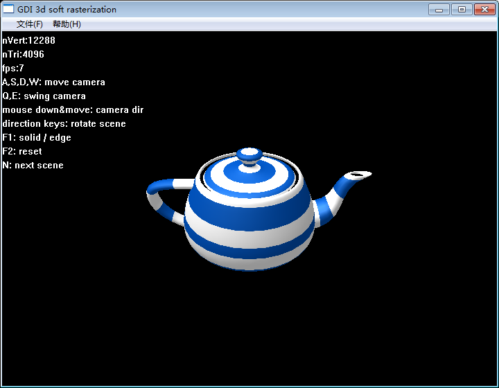
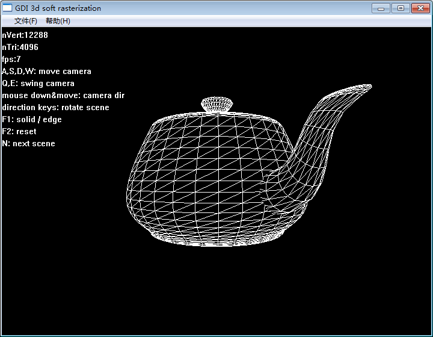
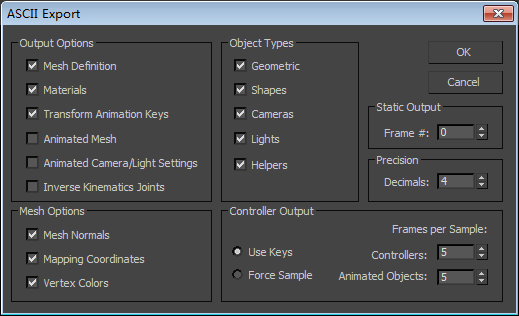

一，功能说明：

窗口左上角nVert，nTri，fps分别显示模型的 顶点数，三角面数 和 帧率。

操作：

A,S,D,W：移动相机位置。

Q,E：左边摇摆相机。

鼠标按下并拖动：调整相机朝向。

方向键：旋转场景。

F1：切换显示模式（实体模式/线框模式）。

F2：重置场景。

N：切换到下一个场景。

二，代码说明：

用的是win32工程，使用GDI实现绘图。

1，cry.cpp
是包含windows消息循环的项目主文件，在InitInstance函数中创建gdi3d场景：

gdi3dScene=new Cgdi3dScene();

gdi3dScene-\>init(viewport);

为了避免闪烁，在WndProc的WM_CREATE函数中创建了后备缓冲区，其句柄为hdcBackBuffer。

在WM_PAINT中首先使用BitBlt清屏，然后调用

gdi3dScene-\>softRasterization(hdcBackBuffer);

将gdi3d场景光栅化到后备缓冲区中。

然后再调用BitBlt将后备缓冲区传到屏幕。

2，gdi3d.h中的Cgid3dScene类是实现3d场景光栅化的核心类。

void Cgdi3dScene::softRasterization(HDC hdc);

此函数内部实现了光栅化的全部流程：

（1）顶点提交：submitMesh();将模型数据提交到m_transformedMesh成员对象中。

（2）顶点变换：transformVertexes();对transformedMesh中的顶点数据进行变换（最换结果写回到transformedMesh中），分三段：首先通过

Cvert vertexShaderProgram(const Cc3dMatrix4&modelMat,const
Cc3dCamera\*camera,const Cc3dLightSource\*lightSource,const
Cc3dMaterial\*material,const Cvert&v)

将顶点变换到剪裁空间(clipping space)。然后调用doClippingInClippingSpace()

进行剪裁，这里六个面都进行了剪裁，对于与剪裁面相交的三角面分裂成三个三角面并抛弃在剪裁面外侧者。需要注意的是近剪裁面的剪裁必须在剪裁空间进行，如果在进行了透视除法以后再剪裁近剪裁面会得到错误的结果（因为视点之后的点经过透视除法后坐标是错的，通过作图可以看出来）。其余五个剪裁面的剪裁可以在剪裁空间进行也可以在归一化设备空间中进行，但这里为了统一，全部都在剪裁空间里做的。

接着进行透视除法变换到归一化设备空间（normalized device
space），再进行视口变换变换到视口空间。

（3）光栅化：rasterizeTriangles_solid(HDC
hdc)实现视口空间中三角形的光栅化：首先清空zBuffer，然后对m_transformedMesh中各三角形（顶点已变换到视口空间）进行光栅化。

Cgdi3dScene::fillTriFace_solid(HDC hdc,const Cvert&v0,const Cvert&v1,const
Cvert&v2)实现视口空间三角形v0v1v2的光栅化：如果开启了背面剔除，则根据法线判断正反面，如果是背面则返回。否则对三角形进行光栅化：如果三角形不是平顶或平底三角形，则将其分解成一个平底三角形加一个平顶三角形，然后分别进行扫描线填充，使用下面化栅化规则：

xLeft_int=ceil(xLeft-0.5);

xRight_int=ceil(xRight-1.5);

yTop_int=ceil(yTop-1.5);

yBottom_int=ceil(yBottom-0.5);

这样能保证邻接面之间的像素无重复无遗漏（当然，光栅化规则有多种，只要简单验证一下满足无重复无遗漏的条件即可）。

另外对于z，color，和纹理坐标s,t等需要进行插值计算，对于z和color，由于其在视口空间中与x,y呈线性关系，所以直接进行线性插值即可，但对于纹理坐标s,t，在透视投影模式下视口空间中s,t与x,y并不呈线性关系，所以需要进行非线性插值（即
透视校正）。

另外这里加了一步early
z优化，即将顶点属性的插值分成两步执行，首先只插值计算z值并缓存插值系数，然后与zBuffer中的z进行比较（深度测试），如果z-fail则不再计算其它属性插值，仅当z-pass时才计算其它属性的插值（利用前面缓存的插值系数）。所以会有

CearlyZOutput interpolateInTri_earlyZ(const Cvert&v0,const Cvert&v1,const
Cvert&v2,float x,float y)

和

Cvert interpolateInTri_otherAttributes(const Cvert&v0,const Cvert&v1,const
Cvert&v2,const CearlyZOutput&earlyZOutput)

两个函数。

得到插值顶点interpolatedV后将其传入

Cfrag fragShaderProgram(const Cvert&interpolatedV,const Ctexture\*texture)

进行最后合成，返回最终像素的颜色值。纹理颜色就是在fragShaderProgram中通过

texture-\>getColor(interpolatedV.m_texCoord)

获得并添加上去的。

Cc3dVector4 Ctexture::getColor(const Cc3dVector2&texCoord)

实现了双线性滤波（双线性插值）。

另外注意纹理坐标原点在纹理图片左上角，与opengles一致。

目前纹理只支持bmp格式。

以上是实体（solid）模式的光栅化过程。线框（edge）模式的光栅化过程有所不同，要复杂一些：

对于线框模式，如果不考虑消隐，则非常简单，直接对每个三角面的每条边画线即可（或简单使用背面剔除，但只对凸体才能正确消隐，对一般模型并不适用）；若要实现严谨的消隐，需借助z-buffer和多边形偏移：

1.  首先以实体模式绘制场景，但不进行颜色写入，只得到z-buffer。但注意此过程中要对每个三角面计算polygonOffset值，并在光栅化此三角面时对其每个像素施加此多边形偏移（将三角面推远）。其中polygonOffset值的计算公式为：

polygonOffset=factor\*DZ+r\*units，其中DZ为三角面z方向上的梯度。

1.  绘制线框。注意，绘制线框时不要添加多边形偏移。

使用上面方法可绘制出完美的带消隐的线框模式，见下图：

注意图中壶嘴与壶身的交界处，实现了精确的消隐。

3，当前的光照模型

目前用的是在vertex上计算的Phong光照（ambient, diffuse,
specular），见Cgdi3dScene::vertexShaderProgram()和Cgdi3dScene::fragShaderProgram()。可以修改这两个函数实现其它光照方案。

4，关于ASE模型文件的解析

没有使用第三方库进行解析，是自己实现的解析程序，只支持静态模型。在导出ASE文件时设置如下：

另外目前程序只支持bmp格式，所以需使用bmp格式贴图，或者导出模型以后手动修改ASE文件中的图片文件名后缀为bmp，并将贴图资源通过绘图软件转为bmp格式。

按上述方式导出的模型可以正确解析。
